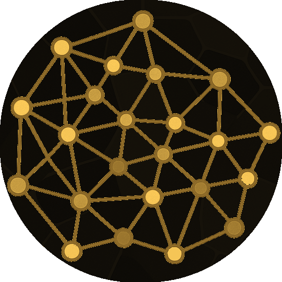
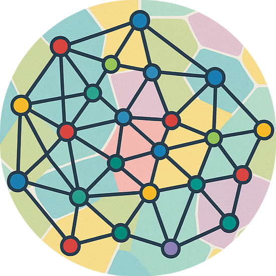
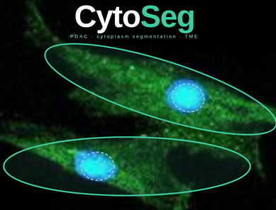

# Owen Griere GitHub

Ingénieur Bio-informaticien

👉 Découvrez mon profil : [Profil](https://owengriere.github.io/)

## BioInformatics Tools (Work in Progress)

C'est dans cette section que mes outils sont en cours de développemement 

### Suite Mosna

|  |  |  |
|:-------------------------:|:--------------------------------:|:--------------------------------------:|
| 
<b>MOSNA Enhanced</b>   *MOSNA and network building rewritten in Rust with a new graphical interface* 
 | 
<b>MOSNA GUI</b>   *Graphical interface wrapping Tysserand and MOSNA to simplify their use* 
 | 
<b>MOSNA Cluster</b>   *Tool to use Mosna on cluster as Genotoul* 
 |
| 

 | 

 | 
 
 |

### Autres outils

|  |  |  |
|:-------------------------:|:--------------------------------:|:--------------------------------------:|
| 
<b>PDAC Modelling</b>   *Pancreatic Ductal Adenocarcinoma Cancer modeling with an agent-based model PhysiCell* 
 | 
<b>SyNetBuilder</b>   *Tool for reconstructing synthetic networks from assortativity data* 
 | 
<b>MORFEE Wrapper</b>   *A Nextflow tools with MORFEE to analyse VCF larges datasets* 
 |
| 
 
 | 

 | 
  
 |
|  |  |  |
| 
<b>CytoSeg</b>   *Segmentation method using ellipse optimisation to segment CAF thanks to marker* 
 | 
<b>AnnData Tools</b>   *Various tools to build AnnData, view the anndata and compute Scanpy and Squidpy* 
 | 
<b>PDACSeg</b>   *Segmentation pipeline to segment PDAC proteomics spatials tissues* 
 |
| 

 | 
 
 | 
  
 |

## Repository where Latex reports are stored (Project and Project Monitoring)

| 

 |
|--------------|
| 
<b>Lab Book</b>
  |
| 

 |
