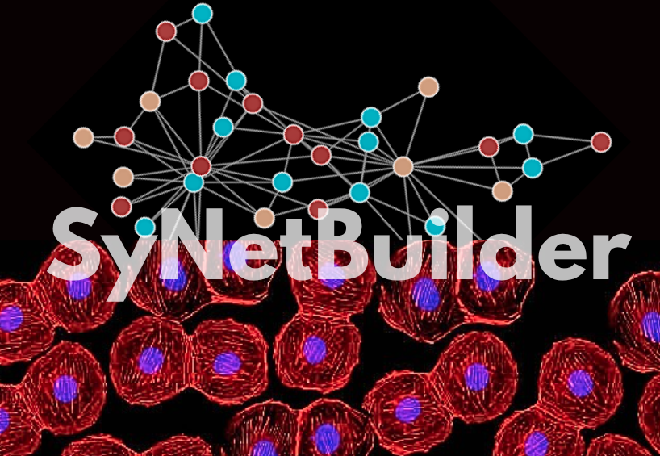
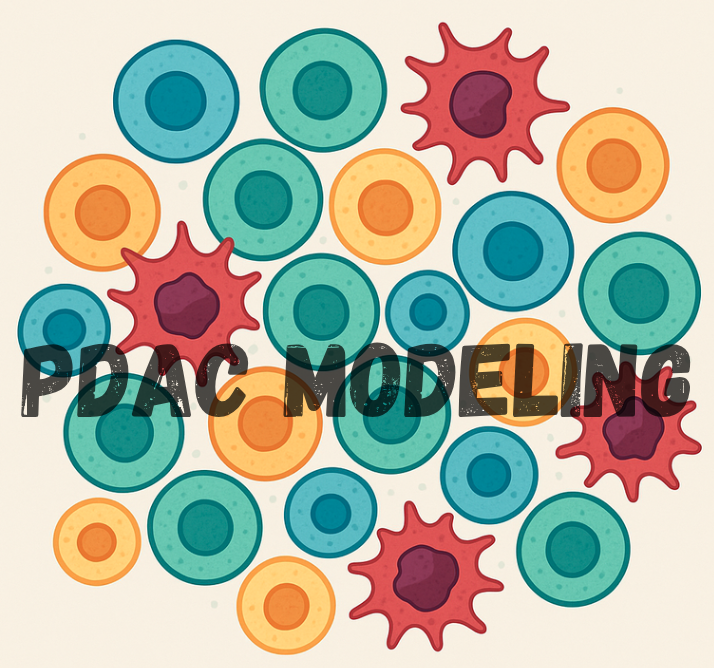
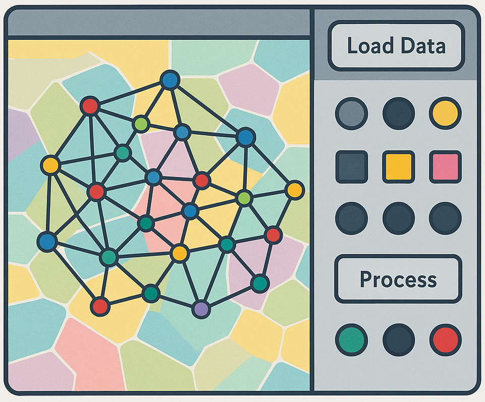
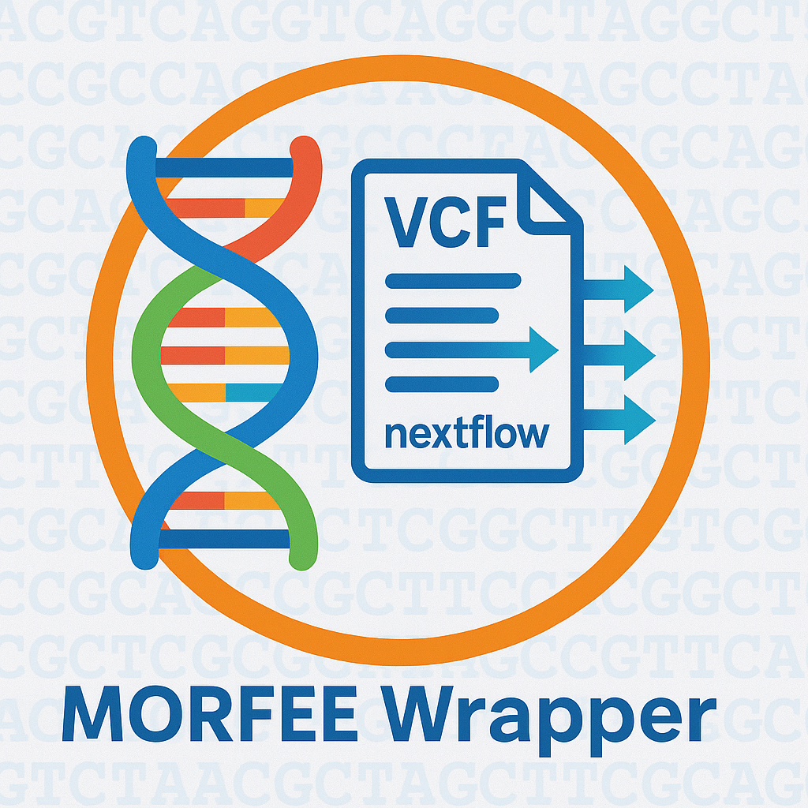
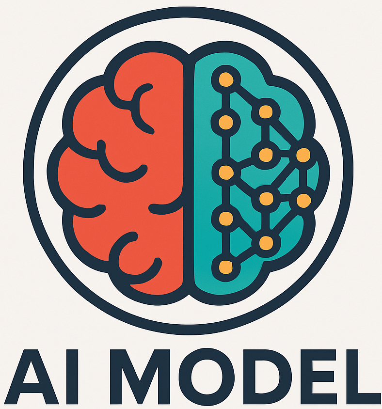

# Owen Griere GitHub

Ingénieur Bio-informaticien

👉 Découvrez mon profil : [Profil](https://owengriere.github.io/)

## Repository where Latex reports are stored (Project and Project Monitoring)

| 

 |
|--------------|
| 
<b>Lab Book</b>
  |
| 

 |

## BioInformatics Tools (Work in Progress)

C'est dans cette section que mes outils sont en cours de développemement 

|  |  |  |
|-------------------------|--------------------------------|--------------------------------------|
| 
<b>SyNetBuilder</b>   *Tool for reconstructing synthetic networks from assortativity data* 
 | 
<b>PDAC Modelling</b>   *Pancreatic Ductal Adenocarcinoma Cancer modeling with an agent-based model PhysiCell* 
 | 
<b>MOSNA GUI</b>   *Graphical interface wrapping Tysserand and MOSNA to simplify their use* 
 |
| 

 | 
 
 | 

 |
|

 | 

 |  |
| 
<b>MORFEE Wrapper</b>   *A Nextflow tools with MORFEE to analyse VCF larges datasets* 
 | 
<b>AI Model</b>   *Various IA models* 
 |  |
| 
 
 | 

 |  |

